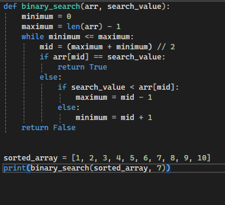

# Binary search algorithm

The Binary search algorithm is a basic algortihm that searches an Element in an sorted array.

## Complexity

- Time Complexity (Best) = O(1)
- Time Complexity (Average) = O(log(n))
- Time Complexity (Worst) = O(log(n))

Space Complexity: O(1)
## Visualization

## Intended use
- good for learning
- good for small arrays
- only for sorted arrays

## Code implementation
