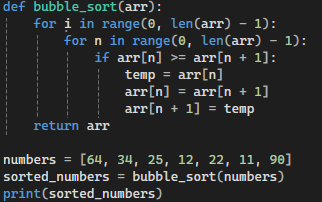

# Bubblesort Algorithm

A Bubblesort algorithm is a basic algorithm that sorts a Array of Numbers in the right order.
The algortihm compare the values from left to right and it looks if the left value is greater than the right value
if this is true these values are switching theire positions.

## Complexity

The bubble sort algorithm has a average/worst time complexity of O(n²)

Space complexity: O(1)

Bestcase: O(n) with optimization

## Visualization

## Intended use

- good for learning
- good for small data
- good for small memory

## Code implementation

