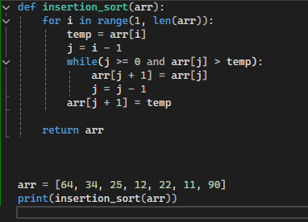

# Insertionsort Algorithm

Insertion Sort is a basic sorting algorithm that builds the final sorted array one element at a time. It works by taking each element from the unsorted portion and inserting it into its correct position in the already sorted portion of the array.

## Complexity

- Time Complexity (Best) = O(n)
- Time Complexity (Average) = O(n²)
- Time Complexity (Worst) = O(n²)

Space Complexity: O(1)

## Visualization

## Intended use
- good for learning
- good for small data
- good for small memory

## Code implementation
