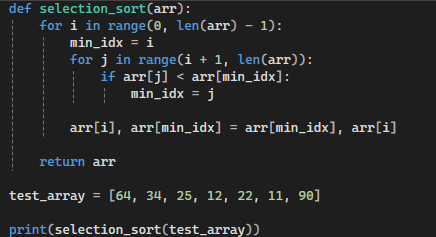

# Selectionsort Algorithm

The Selectionsort algorithm is an easy but unstable sort algorithm that works by repeatedly finding the minimum element from the unsorted portion of the array and placing it at the beginning. It maintains two subarrays within the given array - the first subarray is already sorted, while the second subarray contains the remaining unsorted elements. In each iteration, the algorithm finds the smallest element in the unsorted subarray and swaps it with the first element of the unsorted section, thus expanding the sorted portion by one element.
While it's simple to understand and implement, its instability means it doesn't preserve the relative order of equal elements, which can be important in certain applications. Despite its O(n²) time complexity making it inefficient for large datasets, its simplicity and minimal space requirements (O(1) auxiliary space) make it useful for sorting small arrays or as an educational tool for teaching sorting concepts.

## Complexity

- Time Complexity (Best) = O(n²)
- Time Complexity (Average) = O(n²)
- Time Complexity (Worst) = O(n²)

Space Complexity: O(1)

## Visualization

## Intended use
- good for learning
- good for small data
- good for small memory

## Code implementation
